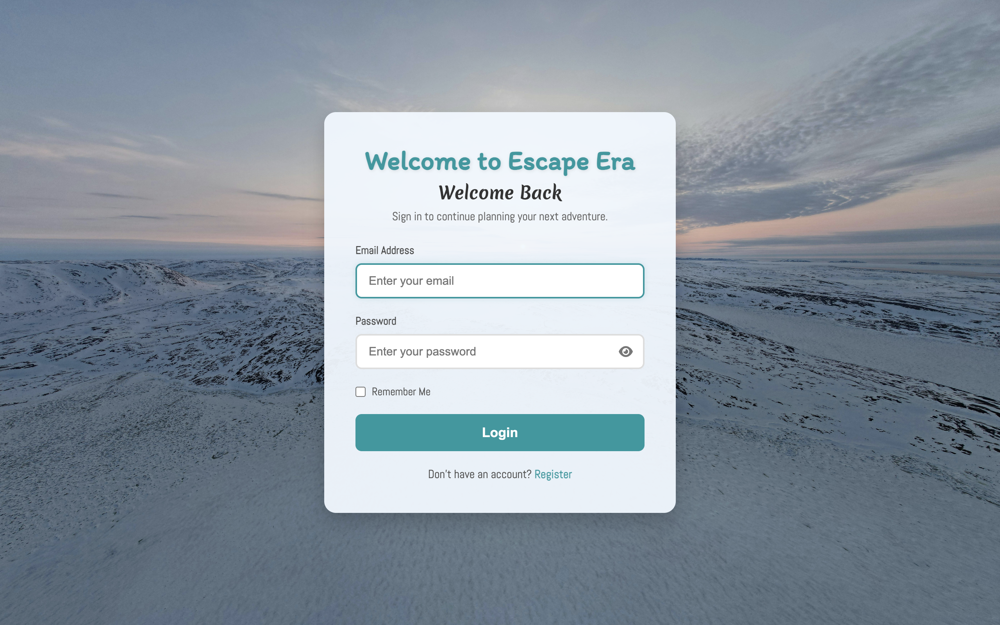
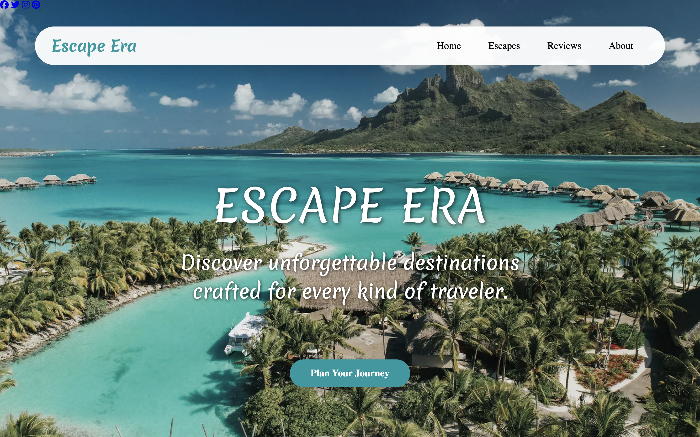
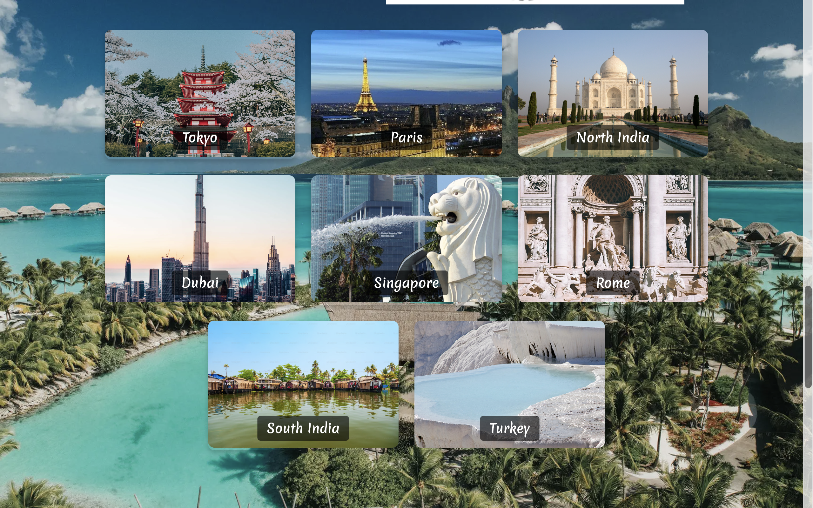

# ✈️ Escape Era

A modern, responsive travel exploration website built using **HTML, CSS, and JavaScript**. Escape Era allows users to explore curated travel destinations, browse destination guides, view traveler reviews, and connect through an interactive contact page—all wrapped in a clean, responsive user interface.

🔗 **Live Demo:** https://ur-ka-shi.github.io/Escape-Era/

---

## 📸 Project Preview

<p align="center">
  
</p>

<p align="center">
  
</p>

<p align="center">
  
</p>

---

## 🌍 Features

* 🏝️ Responsive multi-page travel website
* 🌏 Destination pages for popular travel locations
* 🔍 Destination search functionality
* 🎨 Modern UI with hover effects and animations
* 📱 Responsive layout for desktop and mobile devices
* 👤 Login interface
* 📬 Contact form
* 💬 Customer testimonial section
* 🖼️ Image gallery
* ⬆️ Smooth scrolling and interactive user experience

---

## 🛠️ Tech Stack

* **HTML5**
* **CSS3**
* **JavaScript**
* **Git**
* **GitHub Pages**

---

## 📂 Project Structure

```
Escape-Era
│
├── assets/
├── avatars/
├── css/
│   ├── style1.css
│   ├── style2.css
│   ├── styles.css
│   └── contact.css
│
├── pages/
│   ├── Homepage.html
│   ├── contact.html
│   ├── photo gallery.html
│   ├── tokyo.html
│   ├── paris.html
│   ├── rome.html
│   ├── singapore.html
│   ├── dubai.html
│   ├── turkey.html
│   ├── northindia.html
│   └── southindia.html
│
├── src/
│   └── script.js
│
├── index.html
└── README.md
```

---

## 🚀 Running the Project Locally

Clone the repository

```bash
git clone https://github.com/Ur-ka-shi/Escape-Era.git
```

Navigate to the project

```bash
cd Escape-Era
```

Open **index.html** using your preferred browser or launch the project using **Live Server** in Visual Studio Code.

---

## 📖 What I Learned

While building Escape Era, I gained practical experience in:

* Structuring multi-page websites
* Building responsive layouts using Flexbox
* Creating reusable CSS for consistent styling
* Implementing DOM manipulation with JavaScript
* Managing project assets and folder organization
* Deploying static websites with GitHub Pages
* Version control using Git and GitHub

---

## 🔮 Future Improvements

* User authentication
* Backend integration
* Database connectivity
* Travel booking functionality
* Weather API integration
* Interactive maps
* Personalized travel recommendations

---

## 👩‍💻 Author

**Urvashi Kamble**

Computer Engineering Student

GitHub: https://github.com/Ur-ka-shi

---

### ⭐ If you found this project interesting, consider giving it a star!
